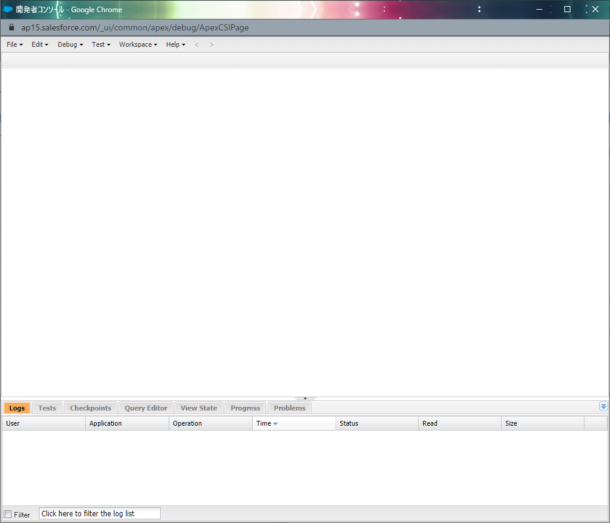
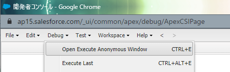
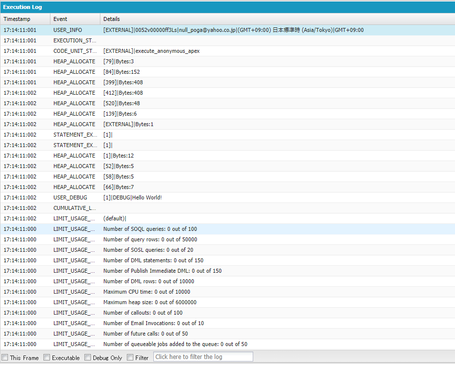
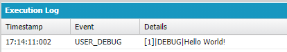
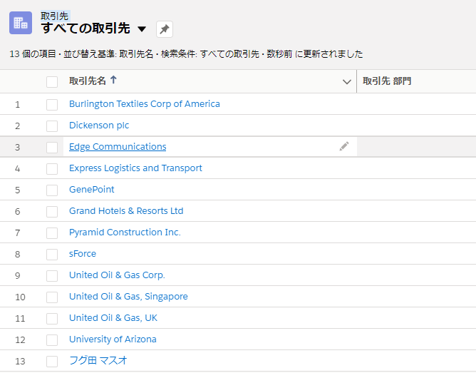
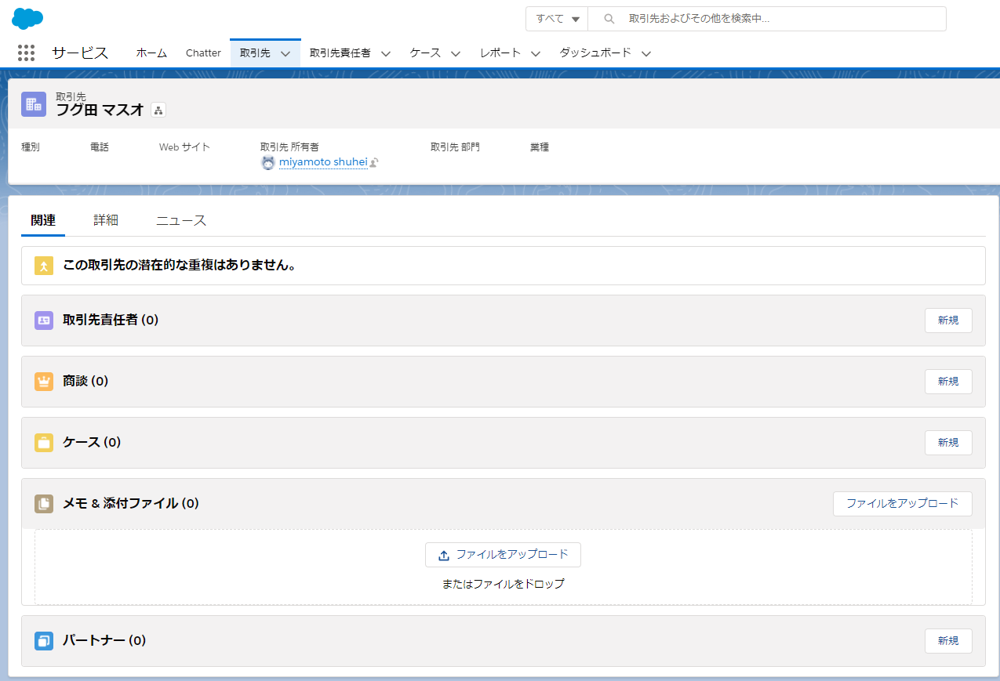
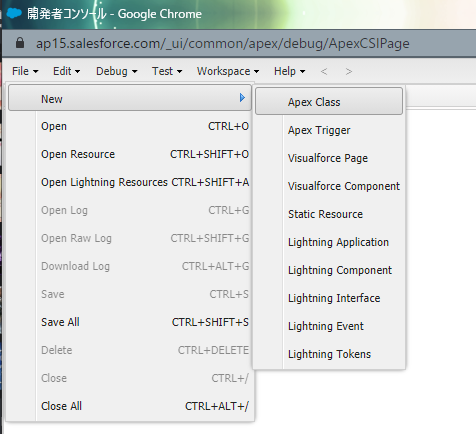
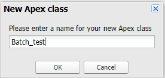

## はじめに
この記事は、宮本が24歳の夏を共に過ごした、Salesforce内部で使用される「Apex」言語についてなるたけわかりやすく説明しようと試みたものです。
気が向いた時に加筆・修正をしていこうと思います。
対象は「Apex? ApexLegendsのことね。なるほどなるほど。」みたいな人を対象にしています。コーダ向けではありません。

## Apexとは？
まずApexとは何かを知りたい場合は、以下のURLを見てください。
https://developer.salesforce.com/docs/atlas.ja-jp.apexcode.meta/apexcode/apex_intro_what_is_apex.htm

Salesforce社の日本語ドキュメントは、機械翻訳なのか何か分かりませんが非常に癖があるように私は感じます。

## とりあえずHello World
百聞は一見にしかず、まずはApexを書いてみましょう。
そのために、まず個人で使えるSalesforce環境を手に入れる必要があります。
https://developer.salesforce.com/jpblogs/2016/04/developer-edition-signup/

この環境は一生を寄り添う伴侶とまではいきませんが、少なくともこの目まぐるしく変わっていく世の中を共に歩いていくパートナーと言えるでしょう。それくらい大事なのです。

環境を手に入れたら早速コードを書いてみましょう。右上にある歯車マークのボタンを押すと「開発者コンソール」がしれっと居るので、押してみましょう。

開くと以下のようなウィンドウが出てきます。おめでとうございます！これでApexを書く準備が整いました。環境を手に入れたあなたは鬼に金棒、どんな世界へも羽ばたいていけることでしょう。

次に画面上部のDebug > Open Execute Anonymous Windowの順にボタンを押下します。
この「Anonymous Window」はApexコードを簡単に実行できる優れものです。これは非常に便利なので使えるようになりましょう。
なお、Ctrl+Eでも起動します。便利だね。

「Enter Apex Code」のウィンドウが出てくるので、以下のコードを入力し「Execute」ボタンを押下しましょう。

System.debug('Hello World');


「Execute」ボタンを押下しても何も反応がありませんが、ご安心ください。
画面下部の「Logs」タブに何やらログが吐き出されているみたいなので開いて確認してみましょう。
ログをダブルクリックすると詳細が表示されます。

開いてみると難しそうなログがたくさん出力されています。

これでは分からないので、ログ出力エリアの下部にある「Debug Only」にチェックを入れてみましょう。

おお！「Hello World」と出力されているではありませんか！
ここまでできたあなたは最高です。これは小さなことに見えますが、あなたにとっては偉大な一歩です。

とはいえ、やはり文字を出力するだけでは味気ないのも事実です。
それならSalesforceっぽいことをしてみましょう。

## 顧客を作る
Apexは本来VisualForceのコントローラ（いずれ説明します）やバッチ処理を行うために使用しますが、
簡単なテストデータを作ったり、sandbox内のデータを更新したりする際にも活用できます。
例として、顧客（Account)を作成してみましょう。

先ほどの手順と同様に、Anonymous Windowを開いて以下のコードを入力し実行してみましょう。

Account acc = new Account();
acc.Name = 'フグ田 マスオ';
insert acc;


実行を押下したら、Salesforceの画面に戻り、「取引先」タブを押下します。
リストビューを「すべての取引先」にして先ほど登録した「フグ田 マスオ」がいることを確認します。

## Apexバッチ

この勢いのままコードを書いてみましょう。男と女のラブゲームと同じように、勢いが大事な時もあります。知りませんが。
File > New > Apex Classとボタンを押下すると「New Apex class」のウィンドウが出てきます。

「Please enter a name for your new Apex class」に「Batch_test」と入力し「OK」ボタンを押下します。

開くと以下の画像のような状態になっていると思います。
ここから、コードを修正していきましょう。

## Apex

Apexを用いてコードを書く際は、「ガバナ制限」を特に考慮する必要があります。
この「ガバナ制限」は、簡単に言うと「他の人も使っている環境でコードを動かすからあんまりピーキーなことすんなボケ」制限です。

Apexを使用する際、結構な頻度でオブジェクト（Oracleでいうテーブル）に対しての操作も行われる印象があります。つまり結構な頻度でガバナ制限と向き合うことが

このガバナ制限を考慮せずに書いたコードは、大半の確立で落ちるか上手く動きません。

- ガバナ制限
- sObjectの取り扱い
- sObjectとコレクション
- テストクラス